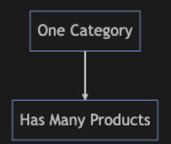

# Question 2: Product Service

This question have 2 challenges

## Challenge 1

For this exercise,please feel free to use Java SE/Java EE/Spring Boot/MVN

(Provide the indications how to run the process)

Category Entity

- Unique ID
- Category Name
- Category Code
- Creation Date

Product Entity

- Unique ID
- Product Name
- Product Code
- Category Code
- Creation Date

Prepare a process to read the file ["TestExampleFile.csv"](TestExampleFile.csv). Each line has one product and one category. The process need to populate the database with that information.

### Constraints

- Product Code is unique
- Category Code is unique
- The process has to validate if the product code already exists in Product Entity
- The process must validate if the category code already exists in Category Entity
- Use Java version >= 17
- Use PostgreSQL DB with the [docker-compose.yml](database/docker-compose.yml)

## Challenge 2

Prepare a Spring boot project to Pagging and sorting

- Product Entities
- Category Entities

The endpoint should support search criteria by product code (Optional)
